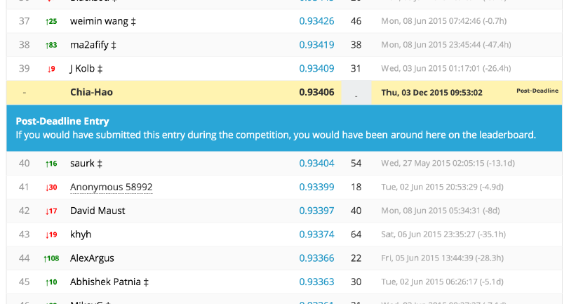

# Kaggle-Robot-Prediction

##Introduction

This is a machine learning project for the Kaggle competition: 
"Facebook Recruiting IV: Human or Robot?
(See https://www.kaggle.com/c/facebook-recruiting-iv-human-or-bot).

This project is done after the Kaggle competition for practice. 
We implemented algorithms including Adaboost, Extremely Randomized Trees, 
and Random Forest. In addition, we also experimented combinations 
of different models to boost overall performance.

##Snapshots of The Leaderboard

Credits to Xinbo Wu, Chia-Hao Hsieh, William Barbour